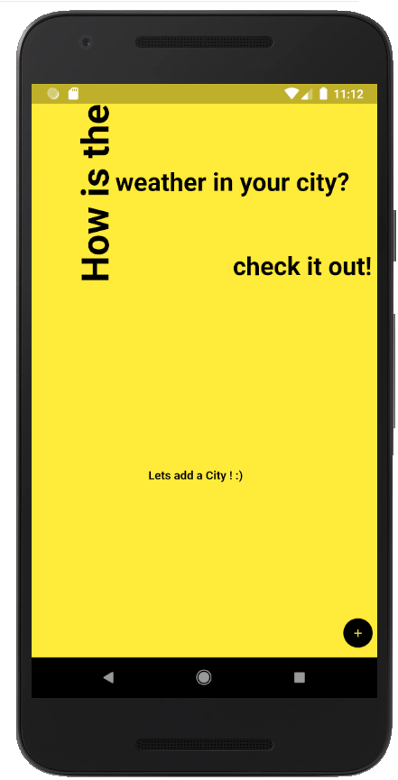
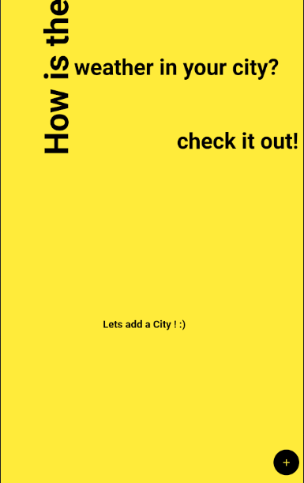

# Flutter studies

Simple repository to show some apps made with Flutter.

## To-do list app

### Weather app

This app we used an api called open weather and sqflite to store data.
The app has 3 pages: 
- the initial page that we need to add a city to see a forecast.
- the second page that show us all the cities the we added with some features button.
- the forecast/weather page that show us the result.

  

