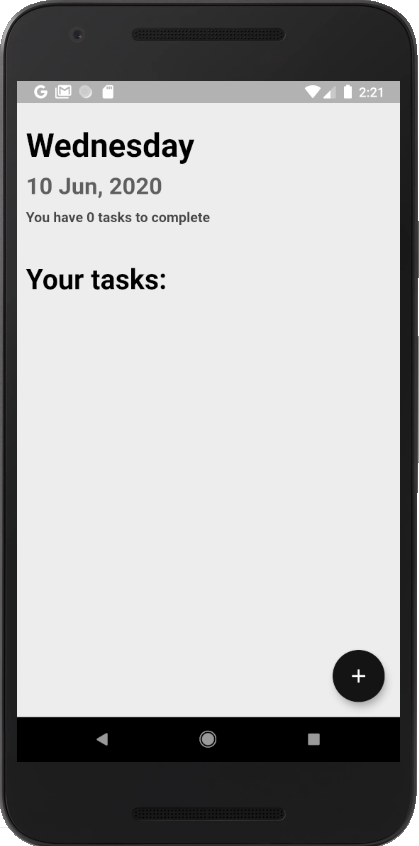
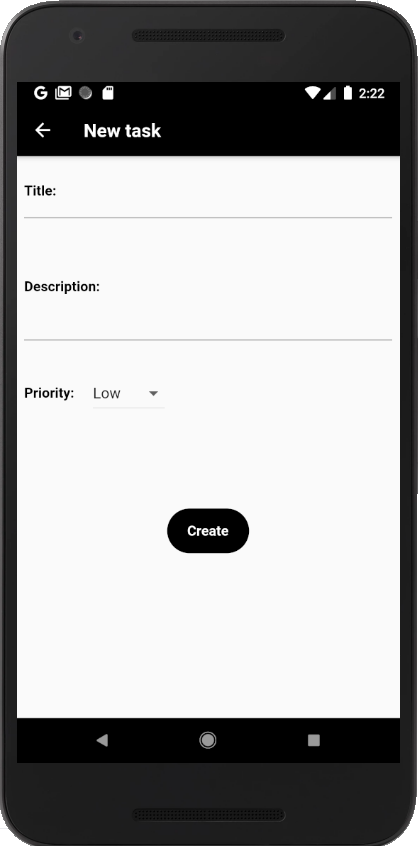
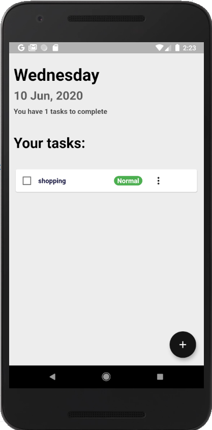
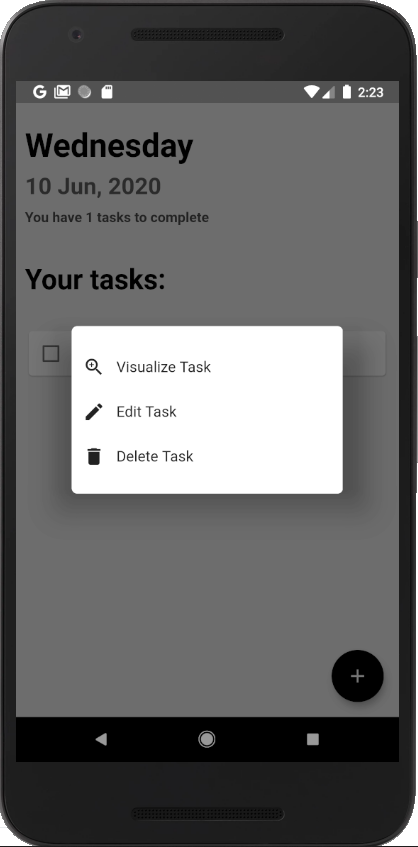

# Flutter studies

Simple repository to show some apps made with Flutter.

## To-do list app

This app we used sqflite to store data and some plugins to help our user experiencie, such as google fonts and  a beautiful splash screen.

The app has 2 pages: 
- the initial page show all our tasks that we add.
- the second page allow us to add a new task with a description and priority.

 In addition we have some buttons with features such as edit, visualize and delete.
 
    
    

### Weather app

This app we used an api called open weather and sqflite to store data.

The app has 3 pages: 
- the initial page that we need to add a city to see a forecast.
- the second page that show us all the cities the we added with some features button.
- the forecast/weather page that show us the result.

  

