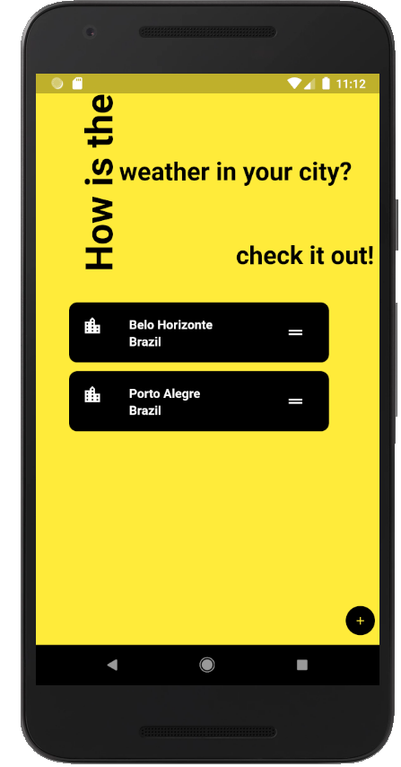
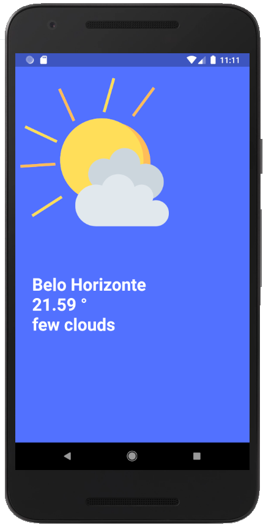

# Weather API

This is an application made in flutter that show us the actual weather forecast of the selected cities by the user.
In this app  we used the open weather api, sqflite to store the data and a minimal concept.

## Homepage

This is the welcome screen and the first screen after adding a city in the add button.

 

### Weatherpage

This is the second screen that show up when we click in a city.

#### Possible forecasts

All the images were made in canvas.

     
